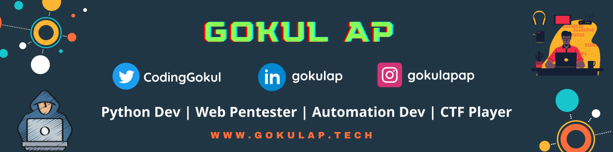
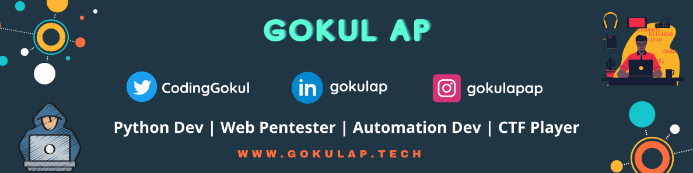

<!--
**gokulapap/gokulapap** is a ✨ _special_ ✨ repository because its `README.md` (this file) appears on your GitHub profile.
Here are some ideas to get you started:
Default

- 🔭 I’m currently working on ...
- 🌱 I’m currently learning ...
- 👯 I’m looking to collaborate on ...
- 🤔 I’m looking for help with ...
- 💬 Ask me about ...
- 📫 How to reach me: ..
- ⚡ Fun fact: ..
-->

<!--
</img>
-->

</img>

### Hi there! 👋 This is Gokul 👨‍💻

### 🚀 About Me

- 🛡️ Cybersecurity enthusiast, automation geek, and DevOps practitioner — building tools that make a difference!
- 🔭 Currently working on Python, Penetration Testing, and DevOps
- ⚙️ Writing `.py` scripts daily to automate security and DevOps workflows
- 🤝 Open to collaborating on Python, Web Development, CTFs and DevOps
- 💬 Ask me about Python, CTFs, Ethical Hacking, Automation and DevSecOps
- 📫 Connect with me: **[GOKUL A.P](https://www.linkedin.com/in/gokulap)** (Linkedin)

### 🏆 Achievements
- 🏅 **Google Hall of Fame** for reporting a critical security vulnerability.
- 🐞 Reported **100+ security vulnerabilities** through bug bounties
- 🔎 Researched and identified Docker security flaws, and cloud vulnerabilities.
- 🛠️ Built **Reconator**, an automated reconnaissance tool for ethical hacking.
- 🌍 **Open-source contributor** to security tools and DevOps projects.
- 🔧 Automated Trivy Docker image scanning & remediation, improving security workflows.
- ⚡ Created a Python based automation tool for scanning Docker images and alerting Critical Secrets.

### 🌐  My Online Presence

 &nbsp;&nbsp;
 &nbsp;&nbsp;
 &nbsp;&nbsp;
 &nbsp;&nbsp;
 

### 💻 Techstack
 
### 👉 Programming languages

<!-- 

 -->

### 👉 Web Programming

<!-- 

 -->

### 👉 Frameworks

<!-- 

 -->

### 👉 Cloud System

<!-- 

   -->

### 👉 Web Servers

<!-- 

 -->

### 👉 Databases

<!-- 

 -->

### 👉 CI/CD

<!-- 

 -->

  

### 👉 DevOps Tools

<!--   
  
    
  
  
  
  
  
   
  
  
  
  
    
  
   -->
  
  
    
  
  
  
  
  
  
  
    
  
  
    
  
  
  

### 👉 Security Tools

  
  
  
  
  
  

### 👉 Software & Tools

  
  
  
  
  
  

### 👉 Operating System

<!-- 

  
 -->

<!--
**📩 Latest Tech Blog Posts**
-->

### 📘 Projects

<!-- split -->

Python

<ul>

<li><a href="https://github.com/gokulapap/Linux-Visual-Search" target="_blank">Linux Visual Search</a></li>
<li><a href="https://github.com/gokulapap/subdomainer-flask" target="_blank">Subdomainer Flask</a></li>
<li><a href="https://github.com/gokulapap/certificate-generator" target="_blank">Certificate Generator</a></li>

</ul>

<!-- split -->

Automation

<ul>

<li><a href="https://github.com/gokulapap/Reconator">Reconator</a></li>
<li><a href="https://github.com/gokulapap/online_class_automation">Online class Automation</a></li>

</ul>

<!-- split -->

Web scraping

<ul>

<li><a href="https://github.com/gokulapap/freedemy" target="_blank">Free Udemy API</a></li>
<li><a href="https://github.com/gokulapap/Autoscraper-n-blogger">Autoscraper-n-blogger</a></li>

</ul>

<!-- split -->

Pentesting

<ul>

<li><a href="https://github.com/gokulapap/submax" target="_blank">Submax</a></li>
<li><a href="https://github.com/gokulapap/Reconator">Reconator</a></li>
<li><a href="https://github.com/gokulapap/subdomainer-flask" target="_blank">Subdomainer flask</a></li>
<li><a href="https://github.com/gokulapap/dirbrute" target="_blank">Dirbrute</a></li>
<li><a href="https://github.com/gokulapap/bugdork" target="_blank">Bugdork</a></li>

</ul>

<!-- split -->

GUI Apps

<ul>

<li><a href="https://github.com/gokulapap/eazy-entry" target="_blank">Eazy Entry</a></li>

</ul>

<!-- split -->

Bots

<ul>

<li><a href="https://github.com/gokulapap/telebots" target="_blank">Telegram bots</a></li>
<li><a href="https://github.com/gokulapap/ai-chat-bot" target="_blank">AI Chat bot</a></li>
<li><a href="https://github.com/gokulapap/whatsasena-plugins" target="_blank">Whatsapp bots</a></li>

</ul>

<!-- split -->

CLI tools

<ul>

<li><a href="https://github.com/gokulapap/wget-drive" target="_blank">Wget Drive</a></li>
<li><a href="https://github.com/gokulapap/urlencode" target="_blank">Urlencode</a></li>
<li><a href="https://github.com/gokulapap/To-Do" target="_blank">To-Do</a></li>
<li><a href="https://github.com/gokulapap/wappalyzer-cli" target="_blank">Wappalyzer-CLI</a></li>
<li><a href="https://github.com/gokulapap/add-del-proto" target="_blank">Add-del-Proto</a></li>
<li><a href="https://github.com/gokulapap/Unshortener" target="_blank">Unshortener</a></li>
<li><a href="https://github.com/gokulapap/CovidVisualizer" target="_blank">Covid Visualizer</a></li>

</ul>

### 🏆 My Top Projects

<table>
  <thead align="center">
    <tr border: none;>
      <td><b>📘 Project</b></td>
      <td><b>⭐ Stars</b></td>
      <td><b>🤝 Forks</b></td>
    </tr>
  </thead>
  <tbody>
    <tr>
      <td><a href="https://github.com/gokulapap/Reconator"><b>Reconator</b></a></td>
      <td></td>
      <td></td>
    </tr>
    <tr>
      <td><a href="https://github.com/gokulapap/Pentesting-Resources"><b>Resources</b></a></td>
      <td></td>
      <td></td>
    </tr>
    <tr>
      <td><a href="https://github.com/gokulapap/wappalyzer-cli"><b>Wappalyzer</b></a></td>
      <td></td>
      <td></td>
    </tr>  
  </tbody>
</table>

 

### 📈 Github Stats
<!-- status codes -->

</a>
&nbsp; &nbsp;

&nbsp; &nbsp;

  

&nbsp;

</img>

