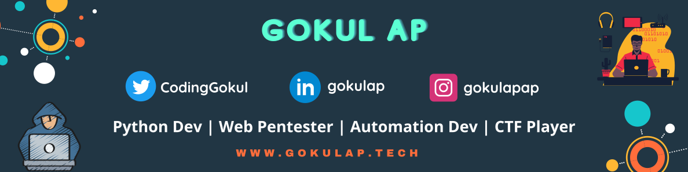

  

<h2 align="center">Hi, I'm Gokul 👨‍💻 — DevOps Engineer & Security Researcher</h2>

  <em>Building tools at the intersection of <b>automation</b>, <b>cloud infrastructure</b>, and <b>offensive security</b>.</em>

  
  
  
  
  

  
  
  
  
  

---

### 🎯 What I'm doing

- 🔭 **Working on:** DevOps engineering, Cloud-native tooling, FinOps automation, and Kubernetes platform engineering
- 🛡️ **Researching:** Cloud security, container hardening, and supply-chain risk in CI/CD
- 🛠️ **Building:** Python automation that turns toil into pull requests
- 🤝 **Open to:** Collaborating on open-source security & DevOps projects
- 💬 **Ask me about:** Python · Pentesting · Kubernetes · Cloud Security · DevSecOps
- ⚡ **Fun fact:** I treat every shell as a Python REPL waiting to happen

---

### 🏆 Selected Work

<table>
  <tr>
    <td width="50%" valign="top">
      <h4>🛰️ <a href="https://github.com/gokulapap/Reconator">Reconator</a></h4>
      
Automated reconnaissance framework for ethical hackers. Chains subdomain enumeration, port scanning, and vulnerability discovery into a single workflow.

      
      
    </td>
    <td width="50%" valign="top">
      <h4>🔧 <a href="https://github.com/gokulapap/kustomize_to_helm">Kustomize → Helm Migrator</a></h4>
      
Production-grade framework for migrating Kubernetes Kustomize overlays into idiomatic Helm charts at scale.

      
    </td>
  </tr>
  <tr>
    <td width="50%" valign="top">
      <h4>📚 <a href="https://github.com/gokulapap/Pentesting-Resources">Pentesting Resources</a></h4>
      
Curated playbook of techniques, payloads, and tooling references from real bug-bounty engagements.

      
    </td>
    <td width="50%" valign="top">
      <h4>🔍 <a href="https://github.com/gokulapap/wappalyzer-cli">Wappalyzer CLI</a></h4>
      
Fast CLI port of Wappalyzer for fingerprinting web technologies during recon — no browser required.

      
    </td>
  </tr>
</table>

More: <a href="https://github.com/gokulapap/submax">submax</a> · <a href="https://github.com/gokulapap/dirbrute">dirbrute</a> · <a href="https://github.com/gokulapap/bugdork">bugdork</a> · <a href="https://github.com/gokulapap/subdomainer-flask">subdomainer-flask</a> · <a href="https://github.com/gokulapap/freedemy">freedemy</a> · <a href="https://github.com/gokulapap?tab=repositories">all repos →</a>

---

### 🧰 Tech I work with

**👨‍💻 Languages**

  
  
  
  
  
  
  
  
  
  

**🧪 Frameworks & Libraries**

  
  
  
  
  
  
  
  

**☁️ Cloud & Infrastructure**

  
  
  
  
  
  
  
  
  
  
  
  
  

**🚀 CI/CD & DevOps**

  
  
  
  
  
  
  
  
  

**📊 Observability & Platform**

  
  
  
  
  
  
  
  
  
  
  
  
  
  

**🗄️ Databases**

  
  
  
  
  
  

**🛡️ Security & Pentesting**

  
  
  
  
  
  
  
  
  
  

**🖥️ Operating Systems & Tools**

  
  
  
  
  
  
  
  

---

### 🌟 Highlights

- 🏅 **Google Hall of Fame** for a security vulnerability disclosed in Google Hangouts
- 🐞 **100+ vulnerabilities** responsibly disclosed across bug-bounty programs
- 🔍 Published research on **Docker** and **cloud-misconfiguration** flaws
- ⚡ Authored a Python tool that auto-scans Docker images for **leaked secrets** and pages on detection
- 🌍 Active **open-source contributor** to security and DevOps tooling

---

### 🌐 Online Presence

  &nbsp;&nbsp;
  &nbsp;&nbsp;
  &nbsp;&nbsp;
  &nbsp;&nbsp;
  &nbsp;&nbsp;
  &nbsp;&nbsp;
  &nbsp;&nbsp;
  

---

### 📊 GitHub Stats

<h4 align="center">📈 Overall Stats & Top Languages</h4>

  
  

<h4 align="center">🔥 Commit Streak</h4>

  

<h4 align="center">📋 Profile Summary</h4>

  
  

  
  

  

<h4 align="center">🌊 Contribution Activity</h4>

  

<h4 align="center">🏆 Achievements</h4>

  

---

  <em>"Automate the boring. Break the broken. Ship the rest."</em>

  ⭐ From <a href="https://github.com/gokulapap">gokulapap</a> — if any of this helped, drop a star on a repo.

