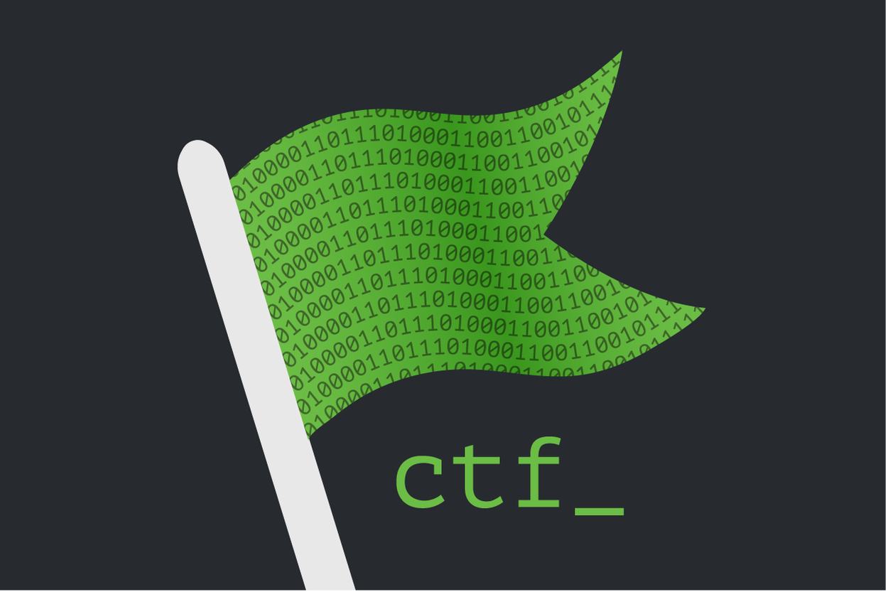
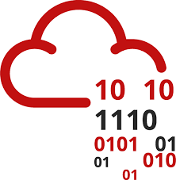

<!--
**gokulapap/gokulapap** is a ✨ _special_ ✨ repository because its `README.md` (this file) appears on your GitHub profile.

Here are some ideas to get you started:

- 🔭 I’m currently working on ...
- 🌱 I’m currently learning ...
- 👯 I’m looking to collaborate on ...
- 🤔 I’m looking for help with ...
- 💬 Ask me about ...
- 📫 How to reach me: ...
- 😄 Pronouns: ...
- ⚡ Fun fact: ...
-->

### Hi there! 👋 This is Gokul 👨‍💻

*Python enthusiast | Web Pentester | CTF player | Automation developer*

 

Here are some information about me:

- 🔭 I’m currently working on python and pentesting
- ⚙️ I use daily: `.py`
- 👯 I’m looking to collaborate on Python, Web Development, CTFs
- 💬 Ask me about C, Python, CTF, Ethical hacking
- 📫 How to reach me: [GOKUL A.P](https://www.linkedin.com/in/gokulap) (Linkedin)

### My Online Presence 👇

  

  
  

<!--
### Hack the box and Try hack me badges
-->

 

**Tools, languages, and other things that I like to work with**

<table>
  <tr>
      <td align="center" width="96">
      
       Python
     </td>

   <td align="center"  width="96">
      
       Burp
    </td>

   <td align="center"  width="96">
      
       Telebots
    </td>

   <td align="center"  width="96">
      
       CTFs
    </td>

   <td align="center"  width="96">
      
       Git
    </td>

   <td align="center"  width="96">
      
       Flask
    </td>

   <td align="center"  width="96">
      
       HTB
    </td>

   <td align="center"  width="96">
      
       THM
    </td>

  </tr>
</table>

 

<!--
**📩 Latest Tech Blog Posts**
-->

**Projects**

<!-- split -->

Python

<ul>

<li><a href="https://github.com/gokulapap/Linux-Visual-Search" target="_blank">Linux Visual Search</a></li>
<li><a href="https://github.com/gokulapap/subdomainer-flask" target="_blank">Subdomainer Flask</a></li>

</ul>

<!-- split -->

Web scraping

<ul>

<li><a href="https://github.com/gokulapap/freedemy" target="_blank">Free Udemy API</a></li>

</ul>

<!-- split -->

Pentesting

<ul>

<li><a href="https://github.com/gokulapap/submax" target="_blank">Submax</a></li>
<li><a href="https://github.com/gokulapap/subdomainer-flask" target="_blank">Subdomainer flask</a></li>
<li><a href="https://github.com/gokulapap/dirbrute" target="_blank">Dirbrute</a></li>
<li><a href="https://github.com/gokulapap/bugdork" target="_blank">Bugdork</a></li>

</ul>

<!-- split -->

GUI Apps

<ul>

<li><a href="https://github.com/gokulapap/eazy-entry" target="_blank">Eazy Entry</a></li>

</ul>

<!-- split -->

Bots

<ul>

<li><a href="https://github.com/gokulapap/telebots" target="_blank">Telegram bots</a></li>
<li><a href="https://github.com/gokulapap/ai-chat-bot" target="_blank">AI Chat bot</a></li>
<li><a href="https://github.com/gokulapap/whatsasena-plugins" target="_blank">Whatsapp bots</a></li>

</ul>

<!-- split -->

CLI tools

<ul>

<li><a href="https://github.com/gokulapap/wget-drive" target="_blank">Wget Drive</a></li>
<li><a href="https://github.com/gokulapap/urlencode" target="_blank">Urlencode</a></li>
<li><a href="https://github.com/gokulapap/To-Do" target="_blank">To-Do</a></li>
<li><a href="https://github.com/gokulapap/add-del-proto" target="_blank">Add-del-Proto</a></li>
<li><a href="https://github.com/gokulapap/Unshortener" target="_blank">Unshortener</a></li>
<li><a href="https://github.com/gokulapap/CovidVisualizer" target="_blank">Covid Visualizer</a></li>

</ul>

## Github Stats 📈
<!-- status codes -->

 
<a href="https://gokulap.hashnode.dev/">
    

    &nbsp;
    

</a>

